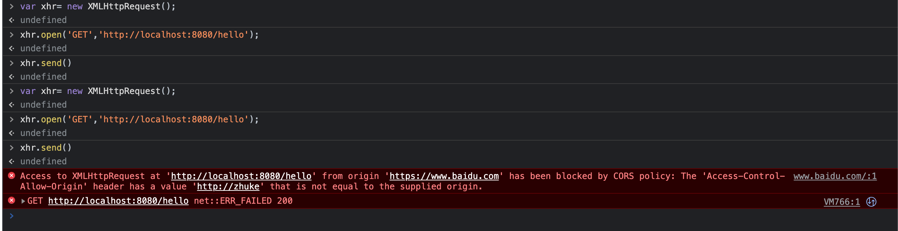

# Springboot2.0 跨域设置案例

日常工作中经常碰到后端需要设置跨域问题。这里弄了个案例，以及如何验证的案例

## 跨域原理

## 日常解决思路

## 安全隐患

## 彻底解决办法

## 验证步骤

* 下载本代码
* ide启动代码
* 打开百度地址，打开f12栏目点开console，进入前端命令行,敲命令：
```javascript
var xhr= new XMLHttpRequest();
xhr.open('GET','http://localhost:8080/hello');
xhr.send(null);
```
* 会显示正常结果,页面不会报错
```javascript
var xhr= new XMLHttpRequest();
>undefined
xhr.open('GET','http://localhost:8080/hello');
>undefined
xhr.send()
>undefined
```
* 将CorsFilter里的ALLOWED_ORIGINS变量更新成下面，在重启后执行上面命令
```java
private static final String[] ALLOWED_ORIGINS={
            //"https://www.baidu.com",
            "http://localhost:8080",
            "http://localhost:8090",
            "https://localhost:8080"
    };
```
* 得到跨域报错，其他的也可以修改下看看得到跨域报错。



## have fun
剩下就是这个代码应用到实际生产项目中了，即限制性的满足跨域，又满足安全要求。

## 最懒的办法
解决一个问题，最好的办法就是不写代码解决，那么如果服务前面有apigateway那就简单了，
直接配置信息到apigateway即可。


